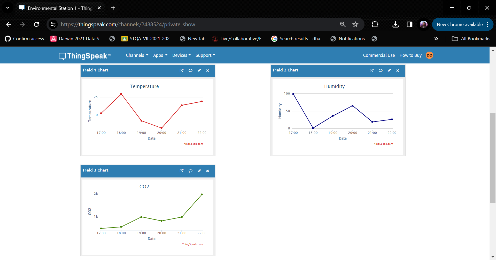

## Simulating IoT Device Data Transmission to ThingSpeak MQTT Broker

- `virtual_sensor.py` is a support script designed to generate random values for sensors, including temperature, humidity, and CO2 levels.

- `assignment.py` manages the connection to the virtual IoT station, retrieving data, and transmitting it to the ThingSpeak MQTT broker.

- Initial Console Output.
  

- Console output after final data submission.
  

- Visualization on the ThingSpeak dashboard following some data entries.

- ThingSpeak dashboard visualization displaying 5 hours of data. For clarity, the data points on the graph have been consolidated:

- `data_for_5_hours.csv`  is a dataset containing simulated sensor readings from the virtual IoT station. This file includes a series of records with the following columns: timestamp, temperature, humidity, and CO2_level. Each row in the file represents a unique set of sensor readings collected at a specific point in time. This dataset contains data for 5 hours.
